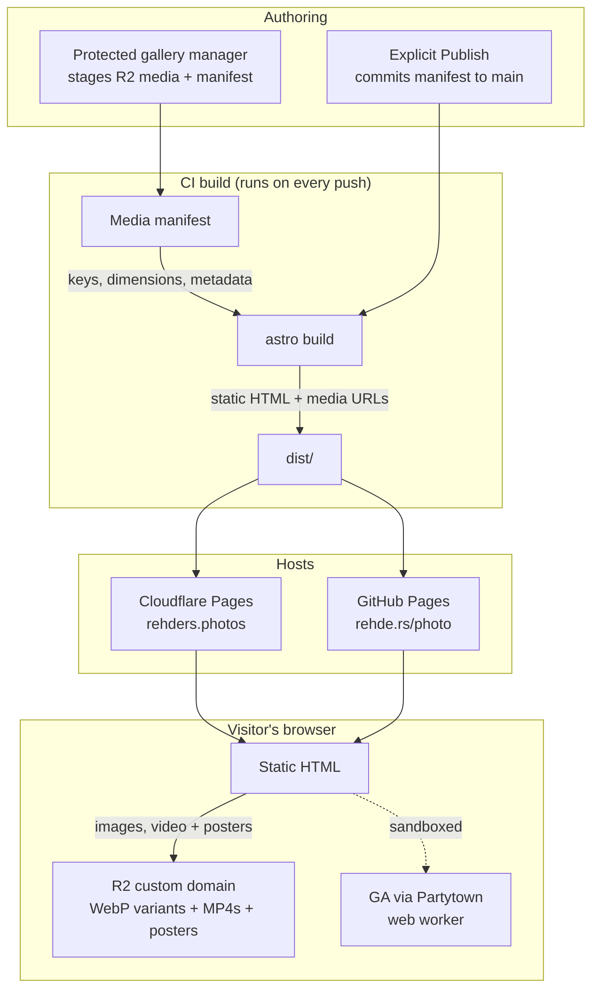

# Rehders Photos Portfolio Site

Source for my concert, sports, and event photography portfolio, hosted at both [rehders.photos](https://rehders.photos) and [rehde.rs/photo](https://rehde.rs/photo).

## Stack

- **[Astro](https://astro.build)** for static site generation
- **[Tailwind](https://tailwindcss.com)** for styling
- **Cloudflare R2** for media storage and delivery
- **[Partytown](https://partytown.builder.io)** to offload Google Analytics into a web worker
- **Two deploys from one repo**:
  - **Cloudflare Pages** → [rehders.photos](https://rehders.photos), built via `@astrojs/cloudflare` on every push to `main`
  - **GitHub Actions → GitHub Pages** → [rehde.rs/photo](https://rehde.rs/photo) (custom domain via `public/CNAME`)

## Architecture

Gallery metadata is stored in `src/data/media-manifest.json`. Image originals live in the private `rehders-photo-originals` R2 bucket. Pre-generated responsive WebP variants, MP4s, and poster images live in `rehders-photo-media` and are delivered through `media.rehders.photos`.



Image variants are generated once during publishing instead of transformed during visitor requests. This avoids Worker CPU limits and keeps delivery as a normal cached R2 object request. The GitHub Pages mirror uses the same canonical Cloudflare media URLs.

## Protected gallery management

Open [`https://rehders.photos/admin/`](https://rehders.photos/admin/) through
Cloudflare Access. Changes are staged until you press **Publish**.

The manager supports:

- uploading photos;
- replacing or deleting gallery assets;
- ordering assets with the up/down controls;
- uploading MP4 videos and poster images;
- replacing video posters;
- replacing the profile, social-sharing, and logo/favicon images.

Image originals are written to the private `rehders-photo-originals` bucket.
Responsive WebP variants, videos, and posters are written to
`rehders-photo-media`. Publishing commits the staged manifest to `main`, which
triggers the normal Cloudflare Pages and GitHub Pages deployments.

### One-time protected publisher setup

1. Keep Cloudflare Access protecting `/admin*` and `/api/media/*`.
2. Bind these R2 buckets to the Pages project:
   - `ORIGINALS` → `rehders-photo-originals`
   - `MEDIA` → `rehders-photo-media`
3. Create a fine-grained GitHub token restricted to `zspherez/photo`, with
   **Contents: Read and write** only.
4. Store it as a Cloudflare Pages secret named `GALLERY_GITHUB_TOKEN`.

Optional Pages variables:

```text
GALLERY_GITHUB_REPOSITORY=zspherez/photo
GALLERY_GITHUB_BRANCH=main
```

## Run locally

```sh
npm install
npm run dev      # http://localhost:4321
npm run build    # writes static site to dist/
npm run preview  # serves the built site
```

Protected admin development can use:

```
# Dashboard auth
CF_ACCESS_TEAM_DOMAIN=    # e.g. yourteam.cloudflareaccess.com
CF_ACCESS_AUD=            # the Access application's Audience (AUD) tag
GALLERY_GITHUB_TOKEN=
DASHBOARD_DEV_BYPASS=1
```

Never configure `DASHBOARD_DEV_BYPASS` in production.

### Emergency CLI fallback

One-time local prerequisites:

```sh
nvm use
npm ci
npx wrangler login
brew install ffmpeg # provides ffprobe for video metadata
```

Publish one or more photos, or every supported image in a directory:

```sh
npm run media:publish -- --folder concerts "/path/to/photos"
npm run media:publish -- --folder system "/path/to/site-images"
```

Supported image folders are `concerts`, `music`, `grads`, `sports`, `events`,
`bts`, `lifestyle`, and `system`. Use the existing asset's base
filename to replace it while preserving its manifest identity, storage key,
and alt text. The `system` folder contains the profile image, social-sharing
image, and logo/favicon.

Publish videos and match poster files by filename:

```sh
npm run media:publish -- \
  --folder video \
  --posters "/path/to/video-thumbnails" \
  "/path/to/videos"
```

The command uploads originals, generates responsive variants, updates matching
assets in the manifest, and preserves existing alt text. Commit the updated
manifest and deploy normally:

```sh
git add src/data/media-manifest.json
git commit -m "Update galleries"
git push
```

Pushing `main` rebuilds both hosted copies.

## Layout

- `src/pages/` — one file per route; each picks a manifest folder
- `src/components/` — gallery variants and the protected gallery manager
- `src/lib/` — media, staging/publishing, and Access verification helpers
- `src/pages/admin/` + `src/pages/api/media/` — protected gallery management
- `wrangler.toml` — R2 bindings + Pages config
- `src/layouts/Layout.astro` — shared page shell (head tags, OG, fonts)
- `src/icons/` — SVG icons inlined via `?raw`
- `public/` — fonts, PDFs (resume / rates / cover), favicon, `CNAME` (the GitHub Pages custom domain)
- `.github/workflows/deploy.yml` — GitHub Pages build & deploy
- `.nvmrc` — pins Node version for the Cloudflare Pages build
- `astro.config.mjs` — uses `@astrojs/cloudflare` for the Cloudflare Pages deploy
