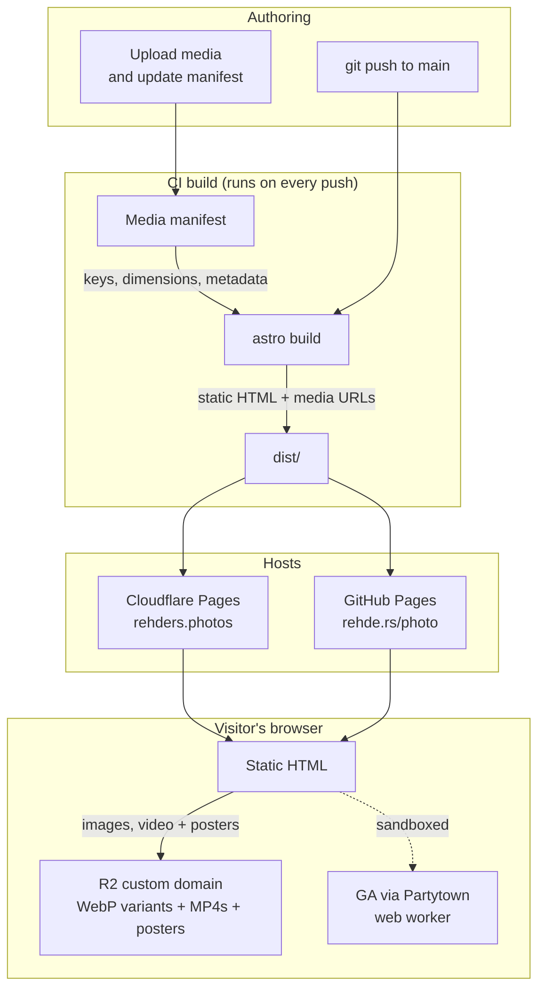

# Rehders Photos Portfolio Site

Source for my concert, sports, and event photography portfolio, hosted at both [rehders.photos](https://rehders.photos) and [rehde.rs/photo](https://rehde.rs/photo).

## Stack

- **[Astro](https://astro.build)** for static site generation
- **[Tailwind](https://tailwindcss.com)** for styling
- **Cloudflare R2 + Images** for media storage, delivery, and image transformations
- **[Partytown](https://partytown.builder.io)** to offload Google Analytics into a web worker
- **Two deploys from one repo**:
  - **Cloudflare Pages** → [rehders.photos](https://rehders.photos), built via `@astrojs/cloudflare` on every push to `main`
  - **GitHub Actions → GitHub Pages** → [rehde.rs/photo](https://rehde.rs/photo) (custom domain via `public/CNAME`)

## Architecture

Gallery metadata is stored in `src/data/media-manifest.json`. Image originals live in the private `rehders-photo-originals` R2 bucket. Pre-generated responsive WebP variants, MP4s, and poster images live in `rehders-photo-media` and are delivered through `media.rehders.photos`.



Image variants are generated once during publishing instead of transformed during visitor requests. This avoids Worker CPU limits and keeps delivery as a normal cached R2 object request. The GitHub Pages mirror uses the same canonical Cloudflare media URLs.

## Run locally

```sh
npm install
npm run dev      # http://localhost:4321
npm run build    # writes static site to dist/
npm run preview  # serves the built site
```

Requires a `.env`:

```
# Print-sales gallery — build-time read of print metadata from Cloudflare D1.
# Needed during BOTH builds so the /prints gallery renders prices/descriptions.
CF_ACCOUNT_ID=
CF_D1_DATABASE_ID=
CF_D1_API_TOKEN=          # API token with D1 read access

# Dashboard auth (used at runtime on the Cloudflare deploy; for local dev you
# can instead set DASHBOARD_DEV_BYPASS=1 to skip Access verification).
CF_ACCESS_TEAM_DOMAIN=    # e.g. yourteam.cloudflareaccess.com
CF_ACCESS_AUD=            # the Access application's Audience (AUD) tag
# DASHBOARD_DEV_BYPASS=1

# Optional: lets the dashboard trigger a Cloudflare Pages rebuild after saving
# print edits (see "How rendering / publishing works" below). Leave unset to
# skip that button.
CF_DEPLOY_HOOK_URL=
```

### Publishing future media

One-time local prerequisites:

```sh
nvm use
npm ci
npx wrangler login
brew install ffmpeg # provides ffprobe for video metadata
```

Publish one or more photos, or every supported image in a directory:

```sh
npm run media:publish -- --folder concerts "/path/to/photos"
npm run media:publish -- --folder prints "/path/to/print-files"
```

Supported image folders are `concerts`, `music`, `grads`, `sports`, `events`,
`bts`, `lifestyle`, `prints`, and `system`. Use the existing asset's base
filename to replace it while preserving its manifest identity, storage key,
and alt text. The `system` folder contains the profile image, social-sharing
image, and logo/favicon.

Publish videos and match poster files by filename:

```sh
npm run media:publish -- \
  --folder video \
  --posters "/path/to/video-thumbnails" \
  "/path/to/videos"
```

The command uploads originals, generates responsive variants, updates matching
assets in the manifest, and preserves existing alt text. Commit the updated
manifest and deploy normally:

```sh
git add src/data/media-manifest.json
git commit -m "Update galleries"
git push
```

Pushing `main` rebuilds both hosted copies. For print images, set the title,
description, and price in `/admin` after publishing; those metadata changes
appear on the public gallery after the next build.

## Print sales (`/prints`) + dashboard (`/admin`)

The `/prints` page is a sales gallery: hover a photo for its title, description and price, click for a custom enlarged view with the full pricing. Prices/descriptions are managed in a live dashboard at `/admin` on the canonical Cloudflare site, backed by a **Cloudflare D1** database.

### Anti-theft

Preview images never expose full resolution. Each rendition is:

- **resolution-capped** by fixed pre-generated variants (~900px in the grid, ~1600px enlarged);
- **watermarked** while protected grid renditions are generated during publishing;
- generated from originals held in a **private R2 bucket** with no public URL.

Only the pre-generated variants are public. Originals remain in a private R2
bucket, so changing a delivery URL cannot reveal the source file.

### How rendering / publishing works

- The public `/prints` gallery is **prerendered** (static) on both deploys. At build time it reads print metadata from D1 over the **D1 REST API** (so even the GitHub Pages build, which has no binding, gets a consistent snapshot).
- The `/admin` dashboard and `/api/prints` endpoint are **on-demand (SSR)** routes that run only on the Cloudflare deploy via the bound `DB` database. On the static GitHub Pages mirror they simply 404.
- Editing in the dashboard writes to D1 immediately; the public gallery reflects changes **on the next build**. Wire a Cloudflare **deploy hook** (and optionally a GitHub `workflow_dispatch`) to rebuild after edits — set its URL as `CF_DEPLOY_HOOK_URL` for the `/api/deploy` endpoint to use.

Metadata for each image resolves in this order: D1 row → manifest alt text → sensible defaults (`src/lib/prints.ts`).

### One-time Cloudflare setup

```sh
# 1. Create the D1 database, then paste the returned id into wrangler.toml
wrangler d1 create prints

# 2. Apply the schema
npm run db:migrate           # remote (production)
npm run db:migrate:local     # local dev database
```

Then, in the Cloudflare dashboard:

- **Bind D1** to the Pages project as `DB` (Settings → Functions → D1 bindings).
- Create the private `rehders-photo-originals` and public `rehders-photo-media` R2 buckets, then connect `media.rehders.photos` to the delivery bucket.
- **Cloudflare Access**: create an Access application protecting `/admin*` and `/api/prints*`, with a policy allowing only your email. Copy its **AUD** tag and your team domain into the Pages env vars.
- **Pages environment variables / secrets**: `CF_ACCOUNT_ID`, `CF_D1_DATABASE_ID`, `CF_D1_API_TOKEN`, `CF_ACCESS_TEAM_DOMAIN`, `CF_ACCESS_AUD`, `CF_DEPLOY_HOOK_URL` (optional).
- **GitHub Pages**: add `CF_ACCOUNT_ID`, `CF_D1_DATABASE_ID`, `CF_D1_API_TOKEN` as Actions secrets (and pass them through in `deploy.yml`) so the mirror's `/prints` gallery shows the same metadata.

Add print originals to the `prints` section of the media manifest, upload them to private R2, then open `/admin` to set titles, descriptions and pricing.

### Local development

`npm run dev` runs with the Cloudflare adapter's platform proxy, so the dashboard and D1 work locally (use `db:migrate:local` first). Set `DASHBOARD_DEV_BYPASS=1` in `.env` to skip Access verification while developing.

## Layout

- `src/pages/` — one file per route; each picks a manifest folder
- `src/components/` — gallery variants (`PhotoGallery`, `VideoGallery`, `Gallery`, `PrintGallery`), header, footer, contact, social
- `src/lib/` — media URL/manifest helpers, print-sales data access, and Access verification
- `src/pages/admin/` + `src/pages/api/prints.ts` — SSR dashboard + metadata API (Cloudflare only)
- `migrations/` — D1 schema; `wrangler.toml` — D1 binding + Pages config
- `src/layouts/Layout.astro` — shared page shell (head tags, OG, fonts)
- `src/icons/` — SVG icons inlined via `?raw`
- `public/` — fonts, PDFs (resume / rates / cover), favicon, `CNAME` (the GitHub Pages custom domain)
- `.github/workflows/deploy.yml` — GitHub Pages build & deploy
- `.nvmrc` — pins Node version for the Cloudflare Pages build
- `astro.config.mjs` — uses `@astrojs/cloudflare` for the Cloudflare Pages deploy
