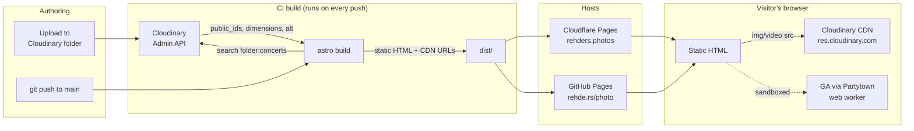

# rehders.photos

Source for my concert, sports, and event photography portfolio, hosted at both [rehders.photos](https://rehders.photos) and [rehde.rs/photo](https://rehde.rs/photo).

## Stack

- **[Astro](https://astro.build)** for static site generation
- **[Tailwind](https://tailwindcss.com)** for styling
- **[Cloudinary](https://cloudinary.com)** as the media library + CDN
- **[Partytown](https://partytown.builder.io)** to offload Google Analytics into a web worker
- **Two deploys from one repo**:
  - **Cloudflare Pages** → [rehders.photos](https://rehders.photos), built via `@astrojs/cloudflare` on every push to `main`
  - **GitHub Actions → GitHub Pages** → [rehde.rs/photo](https://rehde.rs/photo) (custom domain via `public/CNAME`)

## Architecture

Galleries aren't authored as JSON or markdown — they're pulled directly from Cloudinary folders at build time. Each page maps to one folder (e.g. `index.astro` → `concerts`, `sports.astro` → `sports`). Add an image to a folder in Cloudinary, push to `main`, and the new image shows up.



The Cloudinary `api_secret` is only used during the Actions build — it never ends up in the deployed HTML/JS. Output URLs use Cloudinary's auto-transform endpoints (`f_auto,q_auto`), so each browser gets an appropriately sized/encoded image.

## Run locally

```sh
npm install
npm run dev      # http://localhost:4321
npm run build    # writes static site to dist/
npm run preview  # serves the built site
```

Requires a `.env`:

```
PUBLIC_CLOUDINARY_CLOUD_NAME=
PUBLIC_CLOUDINARY_API_KEY=
SECRET_CLOUDINARY_API_KEY=
```

The two `PUBLIC_*` vars are inlined into the client bundle (Astro convention); the `SECRET_*` one stays server-side and is used only during `astro build`.

## Layout

- `src/pages/` — one file per route; each picks a Cloudinary folder
- `src/components/` — gallery variants (`PhotoGallery`, `VideoGallery`, `Gallery`), header, footer, contact, social
- `src/layouts/Layout.astro` — shared page shell (head tags, OG, fonts)
- `src/icons/` — SVG icons inlined via `?raw`
- `public/` — fonts, PDFs (resume / rates / cover), favicon, `CNAME` (the GitHub Pages custom domain)
- `.github/workflows/deploy.yml` — GitHub Pages build & deploy
- `.nvmrc` — pins Node version for the Cloudflare Pages build
- `astro.config.mjs` — uses `@astrojs/cloudflare` for the Cloudflare Pages deploy
