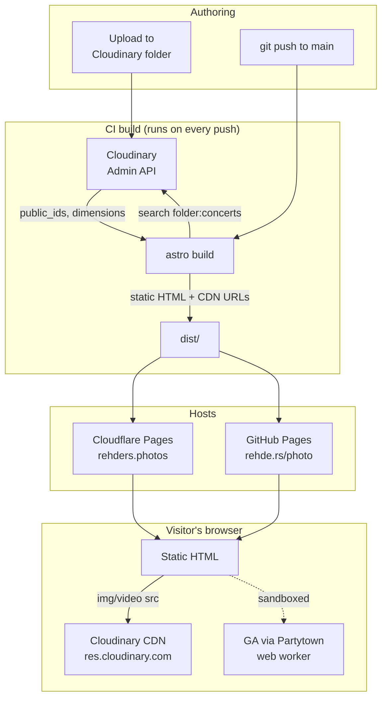

# Rehders Photos Portfolio Site

Source for my concert, sports, and event photography portfolio, hosted at both [rehders.photos](https://rehders.photos) and [rehde.rs/photo](https://rehde.rs/photo).

## Stack

- **[Astro](https://astro.build)** for static site generation
- **[Tailwind](https://tailwindcss.com)** for styling
- **[Cloudinary](https://cloudinary.com)** as the media library + CDN
- **[Partytown](https://partytown.builder.io)** to offload Google Analytics into a web worker
- **Two deploys from one repo**:
  - **Cloudflare Pages** → [rehders.photos](https://rehders.photos), built via `@astrojs/cloudflare` on every push to `main`
  - **GitHub Actions → GitHub Pages** → [rehde.rs/photo](https://rehde.rs/photo) (custom domain via `public/CNAME`)

## Architecture

Galleries aren't authored as JSON or markdown — they're pulled directly from Cloudinary folders at build time. Each page maps to one folder (e.g. `index.astro` → `concerts`, `sports.astro` → `sports`). Add an image to a folder in Cloudinary, push to `main`, and the new image shows up.



The Cloudinary `api_secret` is only used during the Actions build — it never ends up in the deployed HTML/JS. Output URLs use Cloudinary's auto-transform endpoints (`f_auto,q_auto`), so each browser gets an appropriately sized/encoded image.

## Run locally

```sh
npm install
npm run dev      # http://localhost:4321
npm run build    # writes static site to dist/
npm run preview  # serves the built site
```

Requires a `.env`:

```
PUBLIC_CLOUDINARY_CLOUD_NAME=
PUBLIC_CLOUDINARY_API_KEY=
SECRET_CLOUDINARY_API_KEY=

# Print-sales gallery — build-time read of print metadata from Cloudflare D1.
# Needed during BOTH builds so the /prints gallery renders prices/descriptions.
CF_ACCOUNT_ID=
CF_D1_DATABASE_ID=
CF_D1_API_TOKEN=          # API token with D1 read access

# Dashboard auth (used at runtime on the Cloudflare deploy; for local dev you
# can instead set DASHBOARD_DEV_BYPASS=1 to skip Access verification).
CF_ACCESS_TEAM_DOMAIN=    # e.g. yourteam.cloudflareaccess.com
CF_ACCESS_AUD=            # the Access application's Audience (AUD) tag
# DASHBOARD_DEV_BYPASS=1

# Optional: lets the dashboard trigger a Cloudflare Pages rebuild after saving
# print edits (see "How rendering / publishing works" below). Leave unset to
# skip that button.
CF_DEPLOY_HOOK_URL=
```

The two `PUBLIC_*` vars are inlined into the client bundle (Astro convention); the `SECRET_*` one stays server-side and is used only during `astro build`.

## Print sales (`/prints`) + dashboard (`/admin`)

The `/prints` page is a sales gallery: hover a photo for its title, description and price, click for a custom enlarged view with the full pricing. Prices/descriptions are managed in a live dashboard at `/admin` on the canonical Cloudflare site, backed by a **Cloudflare D1** database.

### Anti-theft

Preview images never expose full resolution. Each rendition is:

- **resolution-capped** (`c_limit` — ~900px in the grid, ~1600px enlarged): crisp on screen, useless for a real print;
- **watermarked** with a tiled, semi-transparent text overlay baked into the pixels;
- **delivered via signed URLs** (`s--xxxxxxxx--`), signed with the Cloudinary `api_secret`.

To fully lock it down, enable **Strict Transformations** in the Cloudinary console (Settings → Security → *Allowed for unsigned*: off / require signed). With it on, the original and any un-signed/larger rendition return `401`, so the URL can't be hand-edited to fetch full resolution. The signing helper (`src/lib/cloudinary-image.ts`) uses the Web Crypto API and produces byte-identical signatures to the official SDK.

### How rendering / publishing works

- The public `/prints` gallery is **prerendered** (static) on both deploys. At build time it reads print metadata from D1 over the **D1 REST API** (so even the GitHub Pages build, which has no binding, gets a consistent snapshot).
- The `/admin` dashboard and `/api/prints` endpoint are **on-demand (SSR)** routes that run only on the Cloudflare deploy via the bound `DB` database. On the static GitHub Pages mirror they simply 404.
- Editing in the dashboard writes to D1 immediately; the public gallery reflects changes **on the next build**. Wire a Cloudflare **deploy hook** (and optionally a GitHub `workflow_dispatch`) to rebuild after edits — set its URL as `CF_DEPLOY_HOOK_URL` for the `/api/deploy` endpoint to use.

Metadata for each image resolves in this order: D1 row → Cloudinary contextual metadata (`caption` / `alt`) → sensible defaults (`src/lib/prints.ts`).

### One-time Cloudflare setup

```sh
# 1. Create the D1 database, then paste the returned id into wrangler.toml
wrangler d1 create prints

# 2. Apply the schema
npm run db:migrate           # remote (production)
npm run db:migrate:local     # local dev database
```

Then, in the Cloudflare dashboard:

- **Bind D1** to the Pages project as `DB` (Settings → Functions → D1 bindings).
- **Cloudflare Access**: create an Access application protecting `/admin*` and `/api/prints*`, with a policy allowing only your email. Copy its **AUD** tag and your team domain into the Pages env vars.
- **Pages environment variables / secrets**: `PUBLIC_CLOUDINARY_CLOUD_NAME`, `PUBLIC_CLOUDINARY_API_KEY`, `SECRET_CLOUDINARY_API_KEY`, `CF_ACCOUNT_ID`, `CF_D1_DATABASE_ID`, `CF_D1_API_TOKEN`, `CF_ACCESS_TEAM_DOMAIN`, `CF_ACCESS_AUD`, `CF_DEPLOY_HOOK_URL` (optional).
- **GitHub Pages**: add `CF_ACCOUNT_ID`, `CF_D1_DATABASE_ID`, `CF_D1_API_TOKEN` as Actions secrets (and pass them through in `deploy.yml`) so the mirror's `/prints` gallery shows the same metadata.

Upload the photos you want to sell into a Cloudinary folder named **`prints`**, then open `/admin` to set titles, descriptions and pricing.

### Local development

`npm run dev` runs with the Cloudflare adapter's platform proxy, so the dashboard and D1 work locally (use `db:migrate:local` first). Set `DASHBOARD_DEV_BYPASS=1` in `.env` to skip Access verification while developing.

## Layout

- `src/pages/` — one file per route; each picks a Cloudinary folder
- `src/components/` — gallery variants (`PhotoGallery`, `VideoGallery`, `Gallery`, `PrintGallery`), header, footer, contact, social
- `src/lib/` — print-sales helpers (`prints.ts` data access, `cloudinary-image.ts` signed URLs, `cloudinary-admin.ts` admin API, `auth.ts` Access verification)
- `src/pages/admin/` + `src/pages/api/prints.ts` — SSR dashboard + metadata API (Cloudflare only)
- `migrations/` — D1 schema; `wrangler.toml` — D1 binding + Pages config
- `src/layouts/Layout.astro` — shared page shell (head tags, OG, fonts)
- `src/icons/` — SVG icons inlined via `?raw`
- `public/` — fonts, PDFs (resume / rates / cover), favicon, `CNAME` (the GitHub Pages custom domain)
- `.github/workflows/deploy.yml` — GitHub Pages build & deploy
- `.nvmrc` — pins Node version for the Cloudflare Pages build
- `astro.config.mjs` — uses `@astrojs/cloudflare` for the Cloudflare Pages deploy
